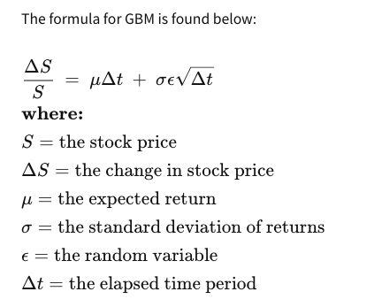
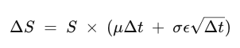
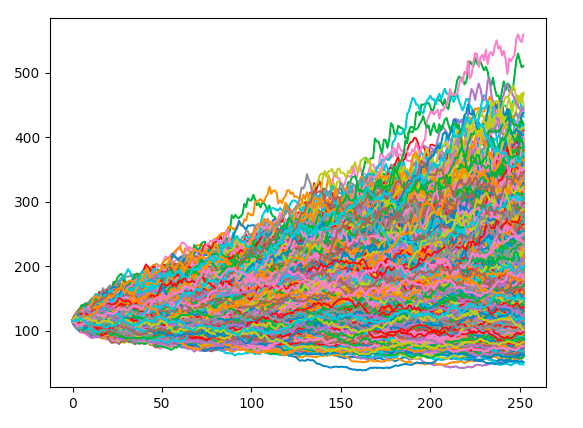
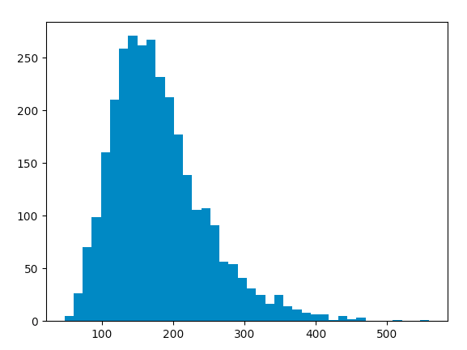
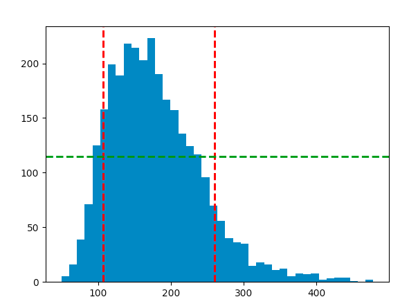

# MonteCarlo Simulation using Geometric Brownian Motion

Now we can multiply both parts by S to get
deviation at each time step. GBM says the change in stock price is the stock price "S" multiplied by the two terms found inside the parenthesis below:

The first term is a "drift" and the second term is a "shock."
Finally we run simulations many times:

